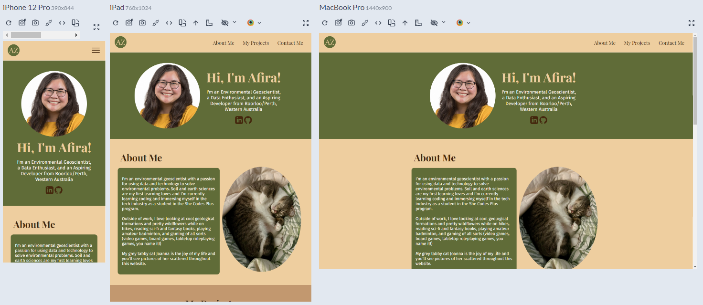
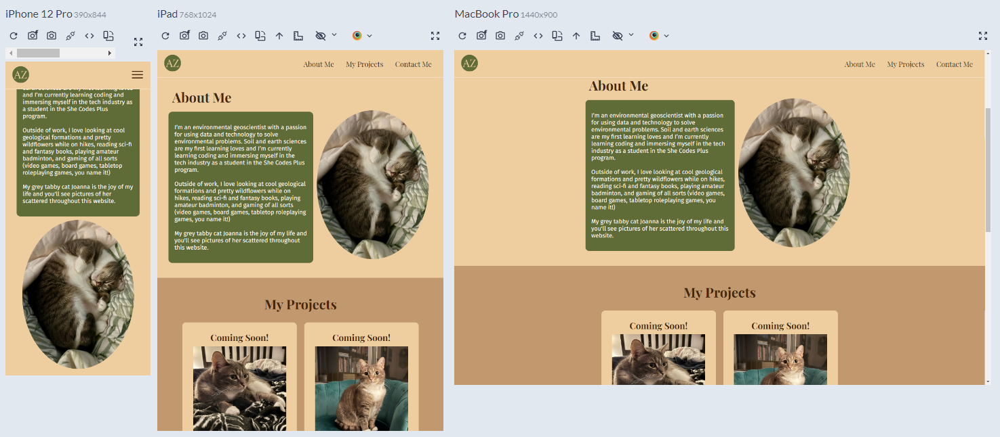
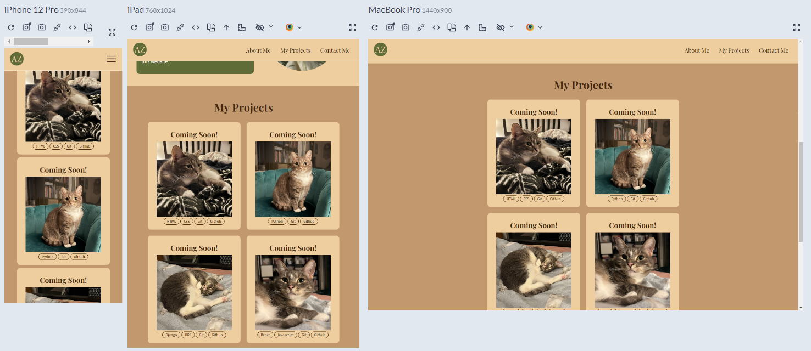
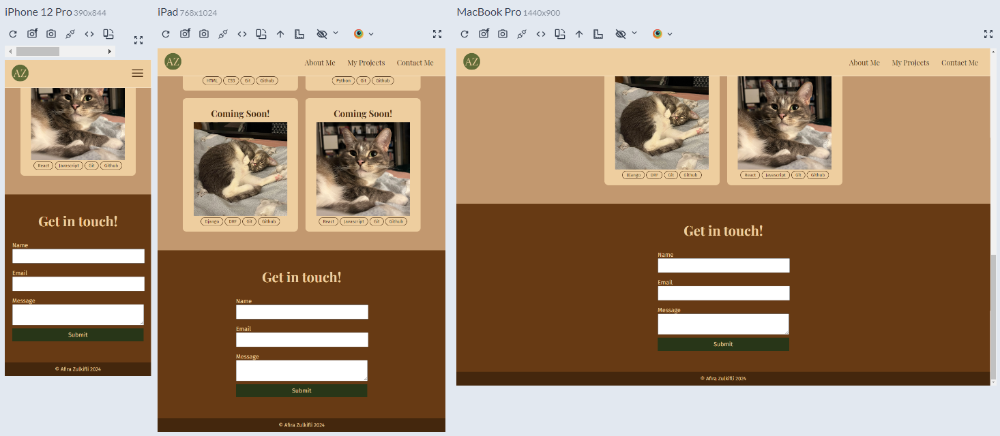
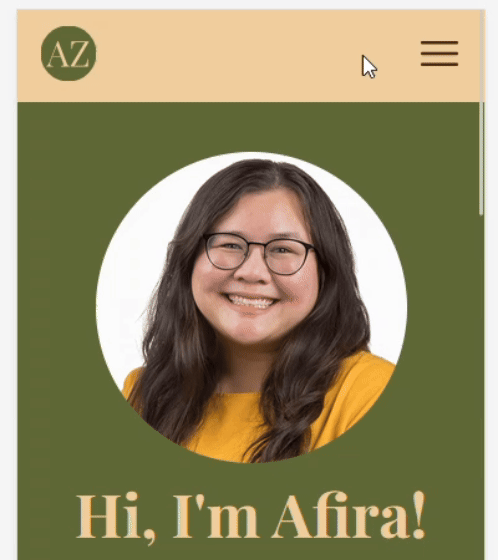
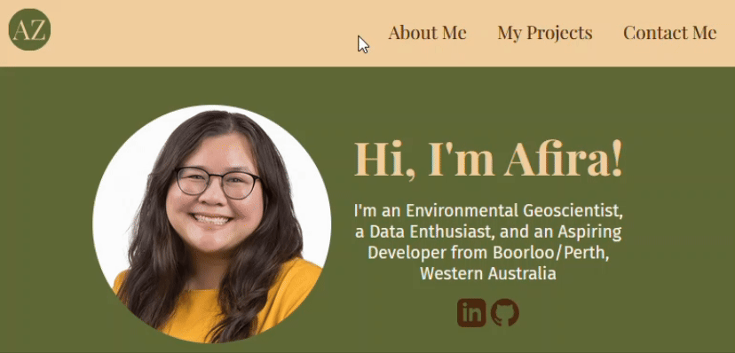
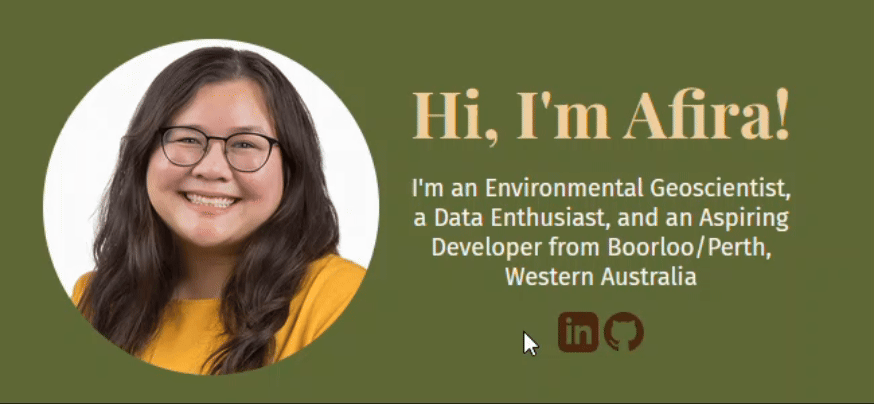

# Afira Zulkifli - Portfolio Task

​
[Have a peek at my portfolio website here!](https://afirazz.github.io/)
​

## Project Requirements

### Content

The first thing you see when you open my portfolio website is a Hero section with a round profile photo of me, a short introductory tagline about myself, and two social media icons that link to my GitHub and LinkedIn profiles which bounce on hover (how I did this is detailed further in the [Bonus](#bonus-optional) section). This is followed by an About Me section which has a short biography of myself and a picture of my cat Joanna (which was supposed to be a placeholder image but is now a permanent fixture because I can't imagine this section without her lil sleepy face on it anymore).

Currently I have four placeholder 'coming soon' project cards in My Projects section that contain a list of languages/frameworks I will use for those projects. I'll be progressively filling in these project cards as I progress through the She Codes Plus program. Until then, please enjoy some photos of my cat Joanna as placeholders :heart_eyes_cat: Lastly, my main page ends with a functional contact form powered by https://formspree.io/ and a footer with my copyright notice.

In honour of my roots in soil science (see what I did there hehe), I've chosen an earthy colour palette where my brand colour is green for standout elements (i.e. the hero section and about me text) and from there the sections go from a creamy brown colour to progressively darker brown colours as you scroll down the webpage, like layers of a soil horizon.

- [x] At least one profile picture
- [x] Biography (at least 100 words)
- [x] Functional Contact Form
- [x] "Projects" section
- [x] Links to external sites, e.g. GitHub and LinkedIn.
      ​

### Technical

My portfolio website has 2 web pages: a main landing page and projects page that is currently a placeholder template for when I have projects to feature on my portfolio. I have version controlled my portfolio website using Git and the version history of my files can be viewed on my GitHub repository [here](https://github.com/afirazz/afirazz.github.io). My portfolio website has been deployed on GitHub pages and can be view through [this link](https://afirazz.github.io/).

I designed my website mobile-first and used media queries to make my website responsive to bigger screen sizes. On desktop screen sizes, my navigation links are listed side-by-side in a row in the header and on mobile screen sizes, my navigation links are hidden until the hamburger icon is clicked, upon which the links will appear from top-to-bottom in a column underneath the hamburger icon. Full credit to [this tutorial by Ivy Walobwa from LogRocket](https://blog.logrocket.com/create-responsive-mobile-menu-css-without-javascript/) which I used to create a responsive mobile menu purely with CSS. You can see this in action [here](#mobile-navigation-menu)! The general layout of my website is also responsive; on desktop screen sizes, there are typically up to two containers next to each other side-by-side (e.g. an image and a box of text) and on mobile screen sizes, the layout condenses to one element on top of each other in a column.

Making my website accessible yet aesthetic is a key priority for me. I've used semantic HTML to structure my website and have chosen Fira Sans as the font for my body text because it is easy to read (and definitely not because the font has part of my name in it, not at all :smirk:). The contrast of my colour choices throughout my website conforms to the Web Content Accessibility Guidelines (WCAG) Level AA according to the [WebAIM Contrast Checker](https://webaim.org/resources/contrastchecker/).

- [x] At least 2 web pages.
- [x] Version controlled with Git
- [x] Deployed on GitHub pages.
- [x] Implements responsive design principles.
- [x] Uses semantic HTML.

### Bonus (optional)

I added a little fun 3D transformation to the social media icons that make them bounce up on hover. Full credit to [Fabrizio Bianchi](http://fabrizio.io/) for this because I saw it on his portfolio website and went "ooh YOINK mine now!". I've also styled the navigation links in the header so that their background colour changes to light brown on hover on both mobile and desktop page sizes. You can see how these work in a [screenshot](#hover-styles) below!

- [x] Different styles for active, hover and focus states.
- [ ] Include JavaScript to add some dynamic elements to your site. (Extra tricky!)
      ​

### Screenshots

I've used the [Responsively app](https://responsively.app/) to demonstrate the responsiveness of my website to the following device screen sizes:

- Mobile: iPhone 12 Pro (390x844)
- Tablet: iPad (768 x 1024)
- Desktop: MacBook Pro (1440x900)

To demonstrate the hidden mobile navigation menu and the hover styles, I did a screen recording using the Windows Snipping Tool application and converted the MP4 file to a GIF file using the free online [Adobe Express converter](https://www.adobe.com/express/feature/video/convert/mp4-to-gif).

#### Main Page

Header & Hero section:

About Me section:

My Projects section:

Contact Me & Footer sections:

#### Mobile Navigation Menu

#### Hover Styles

### Future Improvements

I'm really happy with how my portfolio website has turned out but I also love continous improvement! Below I've listed some of the content and technical improvements I'd like to make in future iterations of my portfolio website.

- [x] Have a brown bottom-border or box-shadow appear on the header as you scroll down the page. Currently it's difficult to differentiate the header when it's over the About Me section because they both have a cream background, however I don't want a bottom-border or box-shadow on the header when it's at the top of the page because you can see it clearly against the green background of the Hero section.
- [ ] Experiment with more curved and natural lines in my website design, e.g. using CSS masking to make my profile picture be masked by a blob shape, or making the top and bottom borders of my sections wavy.
- [ ] Add a focus state to the form input text boxes that change the background colour of the text box when they are selected.
- [x] Add a personalised acknowledgement of country to the footer.
- [x] Use Javascript somewhere on my website to do something cool!
- [ ] Review the use of padding and margins for all elements in the website and see if I can make it more consistent.
- [ ] Fix the header hyperlinks and/or element spacing/sizing so that header doesn’t cut off part of the headings when it jumps to that section.
- [x] Fix the bug where the social media icons cut through the header when you scroll past it on desktop.
